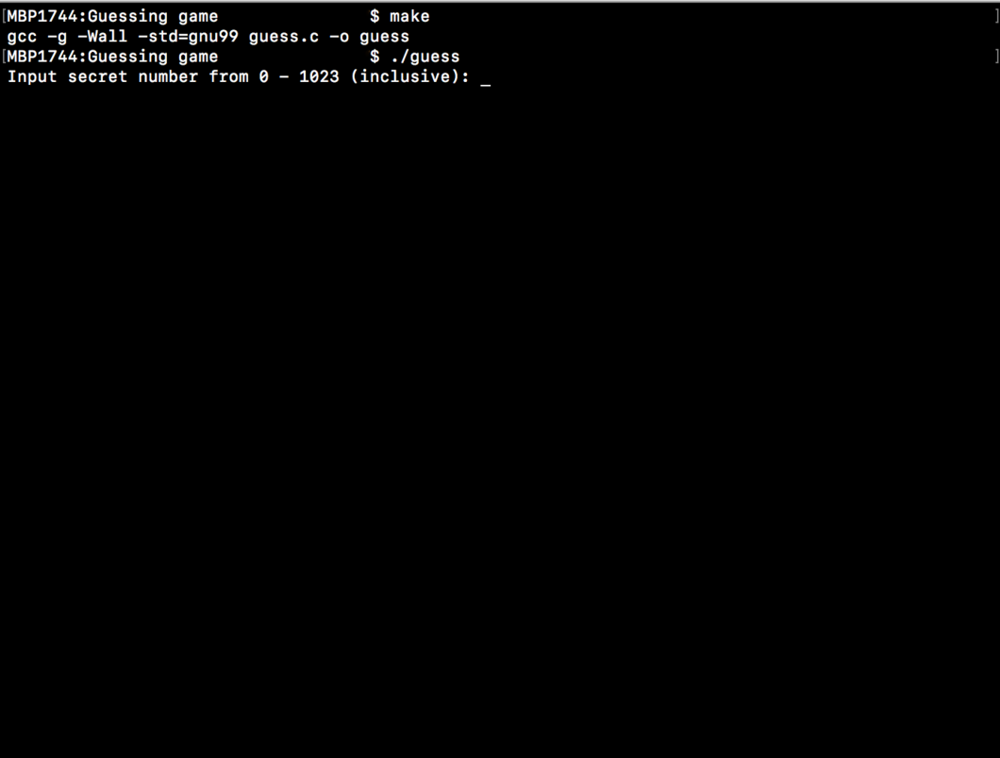
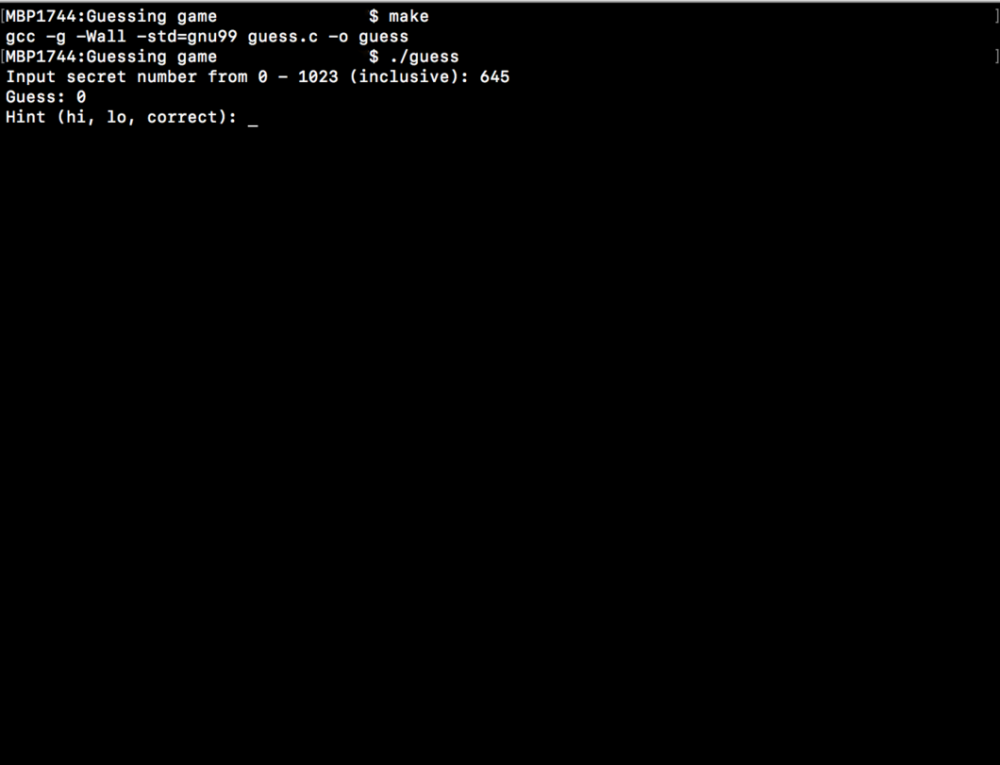
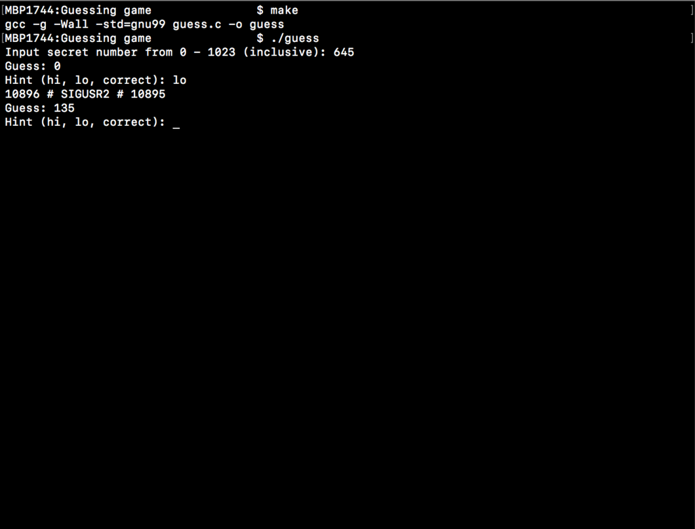
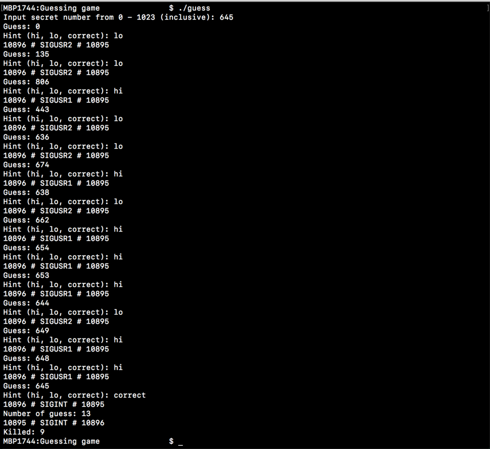

# Overview
When the program begins, it forks into two processes: 
- parent process
- child process

The child process will interact with the user via stdin and stdout. It first prompts the user for a secret number between 0 and 1023 (inclusive). The parent process will try to guess the user's number by randomly picking a number between 0 and 1023 and displaying it to stdout. The user will then enter either _"hi"_ or _"lo"_, depending if the parent's guess is either too high or too low, respectively, compared to the secret that the child process knows (which it input from the user). The child will then send either _SIGUSR1_ or _SIGUSR2_ to the parent process to let it know if its guess is too high or too low, respectively. The parent then guesses a new number and everything repeats until the parent guesses the secret number. At this point, the user will enter _"correct"_ and the child will send a _SIGINT_ signal to the parent to indicate it has guessed correctly. The parent then displays the number of guesses it needed to guess the correct number and then sends a _SIGINT_ signal to the child. When the child receives the _SIGINT_, it kills the parent process and then terminates itself. Each time a process sends a signal, it also prints a string to stderr with the format **senderPID # signal-name # receiverPID** where _senderPID_ is the pid of the sending process, _receiverPID_ is the pid of the receiving process, and _signal-name_ is the name of the signal being sent.

# Tutorial
- First, Use the _make_ command to produce the excutable file and run it. As shown below:

- Next, input the secret number from 0 to 1023 inclusively. As shown below:

- Now, it will ask you for a hint i.e. to indicate whether the guessed number is **lower (lo)** than the secret number, or **higher (hi)**. It will then guess a new number and ask for a new hint. 

- The process continues until the computer correctly guesses the secret number. As shown below:

